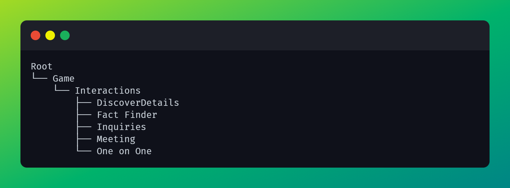

# Project Documentation

This README file will contain any caveats below that you may possibly run into if any issues while making changes.

# P&G Documentation 

These three projects were all built from the Flash to HTML5 conversion build we did for their QPHA project before Flash was depreciated from web browsers.

You can find all the code for each interaction contained in the Movieclip named on the interaction. Just look at the tree below, each Movieclip is located in the root of each folder named after the interaction

The code is documented on what it does. So you will find information in there.

# CLFA/ELFA Be The Boss

Be The Boss was another Adobe Animate project. Like P&G I am just going to list the tree format to find each interaction if they were to request a change which is unlikely. 

Just follow the documentation inside the movieclips for how it works.

