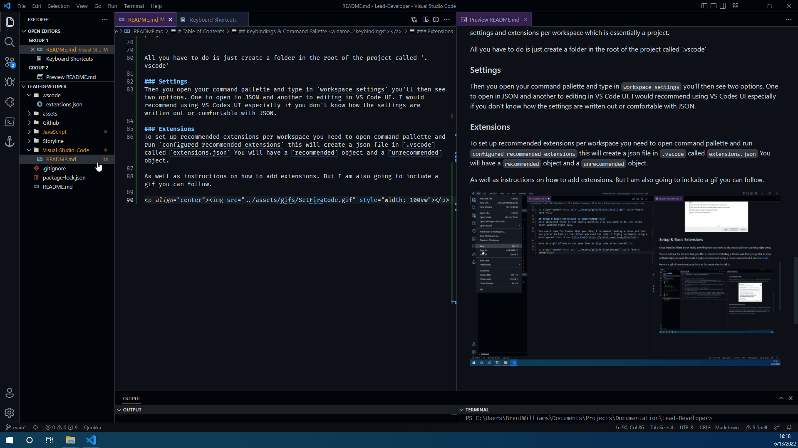

<p align="center"></p>

# Visual Studio Code - Text Editor

Visual Studio Code is a text editor created by Microsoft.

It is my preferred text editor as well as one of the most used text editors by most developers. 

Do not get [Visual Studio Code](https://code.visualstudio.com/) confused with [Microsoft Visual Studio](https://visualstudio.microsoft.com/vs/), they are two different programs. Microsoft Visual Studio is an IDE (Integrated Development Environment) whereas Visual Studio Code is a Code Editor. I will include a quick TL;DR about the difference as well a link to the original article if you would like to read more.

<details>
	<summary>IDE VS Code Editor</summary>

A code editor is an application to write code quickly without providing more advanced development tools. An IDE combines a code editor with built-in advanced development tools to make writing large-scale applications easier and more convenient.

[Source](https://dev.to/vickilanger/eli5-what-is-ide-or-an-ide-hen)
</details>

Every project I have created for Designing Digitally that was not Storyline project, I used a code editor i.e. VS Code because the application was not large enough to do in an IDE. A good example of using an IDE to code is in Unity- Games/Applications built in Unity are large-scale therefore using an IDE to is necessary and incredibly easier. 

----

# Table of Contents

1. [Download & Install](#intro)
2. [Setup & Basic Extensions](#setup)
3. [Keybindings & Command Pallette](#keybindings)
4. [User Snippets](#snippets)
5. [Workspace vs. Program Settings](#workspace)

---

## Download & Install <a name="intro"> </a>
To download VS Code just go to https://code.visualstudio.com/ and click download stable build for windows. Click install and follow the prompts. You as well can just mimic what I do in this gif.

<p align="center"></p>

## Setup & Basic Extensions <a name="setup"></a>
Once installed there is not really anything else you need to do, you could start working right away.

You could look for themes that you like, I recommend finding a theme and font you prefer to look at that helps you read the code. I highly recommend using a mono-spaced font. I use [Fira Code](https://github.com/tonsky/FiraCode).

Here is a gif of how to set your font as fira code after install it.

<p align="center"></p>

## Keybindings & Command Pallette <a name="keybindings"></a>

This section is going to go over how VS Code does keybindings and extension commands from what they call the Command Pallet.

### Keybindings
VS Code does keybindings 2 ways.

1. Conventional way you would see in most programs
   1. Ex: Save = `ctrl+s`
2. I cannot find any name for it, but I will to refer to it as a chord- If you hit `ctrl + k` you will see in the bottom left it says ```waiting for second command of chord```. 
   1. What this means is that you then will press a single key following the `ctrl + k`. 
   2. That is how so many extensions can all include default keybindings it gives the developers a much better change to include bindings aren't default so they wont conflict.
   3. Now it is very possible that you will download two different extensions that conflict- all you need to do is go into your `file -> preferences -> keyboard shortcuts` and seach for the command you want to run and re-assign it to a new binding/chord.

### Commmand Pallette
Most VS Code extensions will come with commands that can be run via terminal. But within VS Code those commands can also be ran by hitting `ctrl + shift + p` 

One command I use frequently is `Reload Window` I use this when I install or uninstall certain extensions that require the entire VS Code instance to be restarted.

### User Snippets
User snippets are a really useful feature where you can use JSON to create snippets of code. _If you are web developer and you a familiar with emmet it is very similar_ 

Hit `ctrl + shift + p` type in `user snippets` you will see the first option saying `configure user snippets` click that and it will open a JSON file.

Now if you are new to JavaScript/JSON it can look intimidating. 
> Here is a snippet generator website. All you have to do is give it a description, tab trigger (characters to invoke the snippet), and write the code you want the snippet to produce. [Snippet Generator](https://snippet-generator.app/?description=&tabtrigger=&snippet=&mode=vscode).

We will go over this in the JavaScript Demo more.

### Workspace vs User Settings
VS Code is a very powerful program for as lite as it is. Last thing I will go over is how you can setup settings and extensions per workspace which is essentially a project.


All you have to do is just create a folder in the root of the project called '.vscode' 

### Settings
Then you open your command pallette and type in `workspace settings` you'll then see two options. One to open in JSON and another to editing in VS Code UI. I would recommend using VS Codes UI especially if you don't know how the settings are written out or comfortable with JSON. 

### Extensions
To set up recommended extensions per workspace you need to open command pallette and run `configured recommended extensions` this will create a json file in `.vscode` called `extensions.json` You will have a `recommended` object and a `unrecommended` object. 

As well as instructions on how to add extensions. But I am also going to include a gif you can follow.

<p align="center"></p>