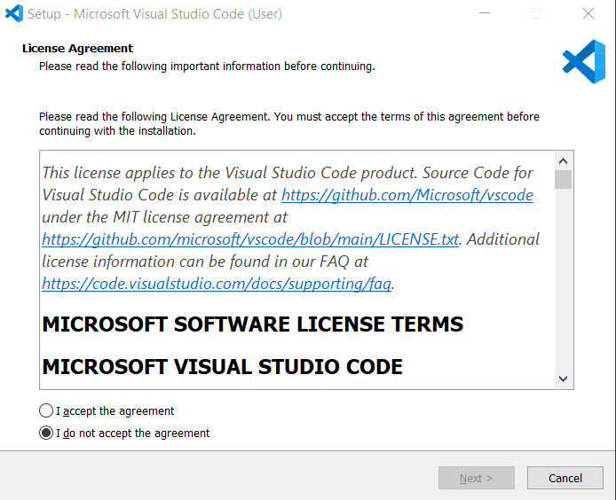
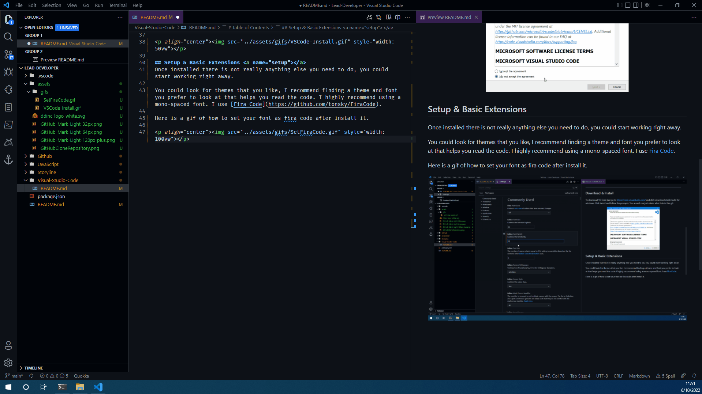

# Visual Studio Code - Text Editor

Visual Studio Code is a text editor created by Microsoft.

It is my preferred text editor as well as one of the most used text editors by most developers. 

Do not get [Visual Studio Code](https://code.visualstudio.com/) confused with [Microsoft Visual Studio](https://visualstudio.microsoft.com/vs/), they are two different programs. Microsoft Visual Studio is an IDE (Integrated Development Environment) whereas Visual Studio Code is a Code Editor. I will include a quick TL;DR about the difference as well a link to the original article if you would like to read more.

	
IDE VS Code Editor

A code editor is an application to write code quickly without providing more advanced development tools. An IDE combines a code editor with built-in advanced development tools to make writing large-scale applications easier and more convenient.

[Source](https://dev.to/vickilanger/eli5-what-is-ide-or-an-ide-hen)

Every project I have created for Designing Digitally that was not Storyline project, I used a code editor i.e. VS Code because the application was not large enough to do in an IDE. A good example of using an IDE to code is in Unity- Games/Applications built in Unity are large-scale therefore using an IDE to is necessary and incredibly easier. 

----

# Table of Contents

1. [Download & Install](#intro)
2. [Setup & Basic Extensions](#setup)
3. [Keybindings & Command Pallette](#keybindings)
4. [Useful Views](#views)
5. [Recommended Extensions](#extensions)
6. [User Snippets](#snippets)
7. [Workspace vs. Program Settings](#workspace)

---

## Download & Install 
To download VS Code just go to https://code.visualstudio.com/ and click download stable build for windows. Click install and follow the prompts. You as well can just mimic what I do in this gif.

## Setup & Basic Extensions 
Once installed there is not really anything else you need to do, you could start working right away.

You could look for themes that you like, I recommend finding a theme and font you prefer to look at that helps you read the code. I highly recommend using a mono-spaced font. I use [Fira Code](https://github.com/tonsky/FiraCode).

Here is a gif of how to set your font as fira code after install it.

